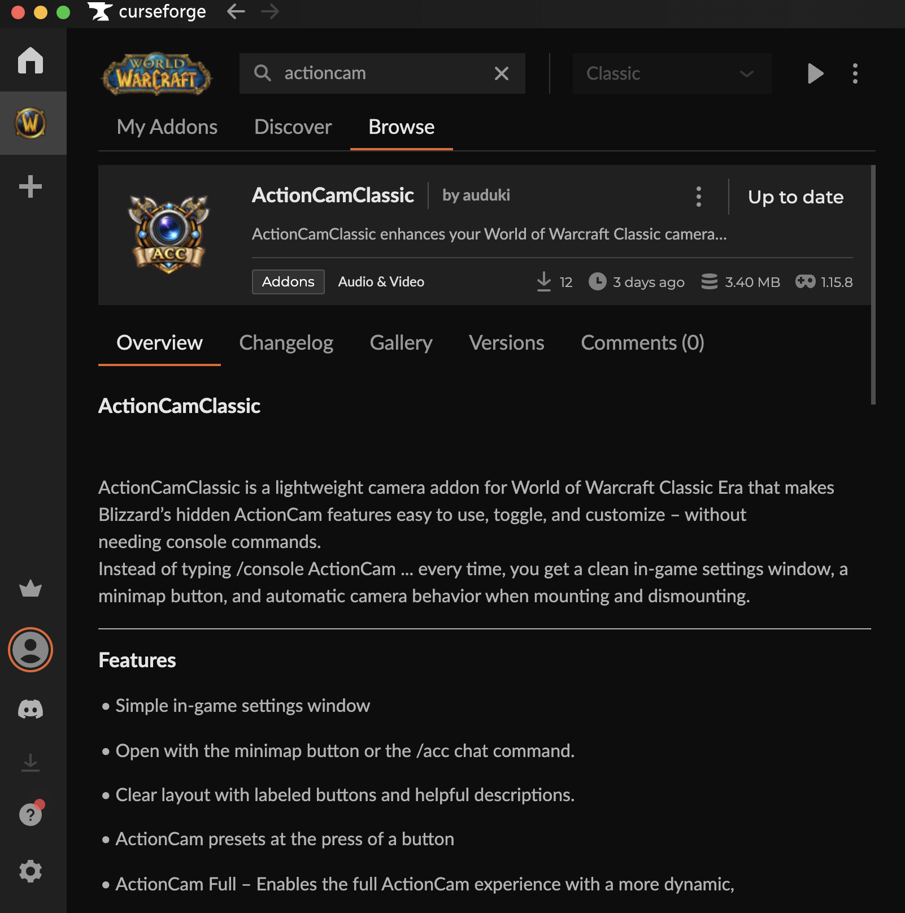
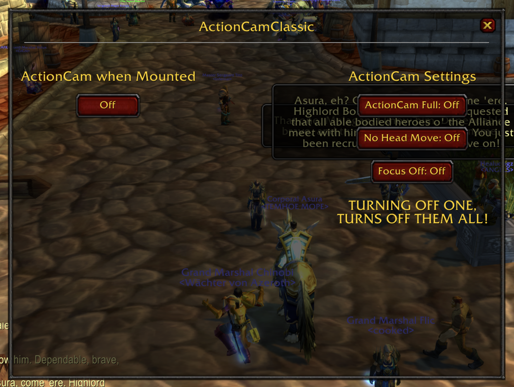
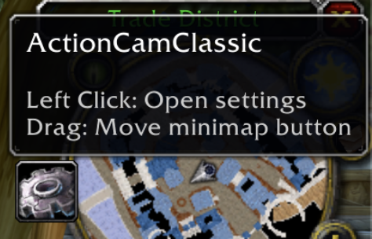

# ActionCamClassic Addon for World of Warcraft Classic Era

## Beskrivelse

Addonen er skrevet i Lua. Addonen i spillet gir spilleren en enkel oversikt og brukervenlig UI for å utnytte spillets Action Camera instillinger. Disse innstillingene er vanlighvis veldig vanskelig å komme til.

Addonen inneholder en funksjon hvor kameraet endrer til action kamera når spilleren begynner å ri på hesten sin. Det er også noen knapper hvor spilleren kan skru på fullstendig action camera eller delvis.

## Hvordan kjøre programmet

Du må nedlaste spillet World of Warcraft Classic Era via Battle.Net launcheren til Blizzard. 

Deretter kan spilleren nedlaste addonen ved å extracte zip. filen inn i `/Applications/World of Warcraft/_classic_era_/Interface/AddOns`

Spilleren må så åpne spillet på nytt eller skrive `/reload` eller `/rl` i chatten for å reloade alle nye filer og oppdateringer. 

## Kildeliste:

Jeg fikk ideen fra video på youtube via følgende link: https://www.youtube.com/watch?v=s_yWO_UtDjA
Jeg hadde lyst til å lære meg språket og ikke kun bruke ChatGPT for å generere hele Addonen slik videoen gjør.

Eller har jeg brukt ChatGPT for å få veiledning i hvordan man bruker Lua til å kode Addons: https://chatgpt.com

## Curseforge: 

Etter å ha finjustert koden og designet på addon-en in-game, bestemte jeg meg for å legge den ut på Curseforge. Dette er en app designet av Overwolf og er en browser for spill plug-ins og mods.

Jeg ga dem zip filen av prosjektet og fikk noen tilbake meldinger på hva jeg måtte endre for at den skulle bli "approved" av deres moderatorer. Etter å ha oppdatert og gitt ChatGPT feilmeldingne jeg fikk av curseforge kjørte den noen terminal kommandoer og den ble akkseptert av Curseforge 5 minutter senere. 

## Bilder av Addon in-game

